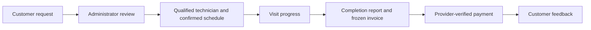

# FieldOps API

**Reliable service operations, from the first request to a verified payment.**

FieldOps connects customers, field technicians and service administrators through one
traceable workflow. This API owns access control, technician availability, work progress,
invoicing and payment settlement, so teams can coordinate visits without losing the
operational or financial history.

[Live application](https://fieldops-rafiferdos.vercel.app) ·
[Live API](https://fieldops-api-xu3s.onrender.com/api/v1) ·
[API readiness](https://fieldops-api-xu3s.onrender.com/api/v1/health/ready) ·
[Frontend repository](https://github.com/rafiferdos/fieldops) ·
[Backend repository](https://github.com/rafiferdos/fieldops-api)

[](https://github.com/rafiferdos/fieldops-api/actions/workflows/ci.yml)

## Why FieldOps exists

Service businesses often coordinate requests in messages, schedules in spreadsheets and
payments in a separate ledger. That makes it easy to double-book technicians, lose job
context, change a quoted price accidentally or treat an unverified payment as settled.
FieldOps keeps those decisions connected and enforces their rules where the data is stored.

| Operational problem                                          | Implemented outcome                                                          |
| ------------------------------------------------------------ | ---------------------------------------------------------------------------- |
| Unclear request ownership and handoffs                       | Role-scoped requests, explicit review and a retained work timeline           |
| Scheduling collisions                                        | Skill-based availability and database-enforced non-overlapping active visits |
| Prices changing after a visit is agreed                      | Assignment price snapshots and immutable completion invoices                 |
| Duplicate checkout, callbacks or uncertain gateway responses | Durable idempotency, provider validation and explicit reconciliation         |
| Account changes leaving old access usable                    | Current account/session checks and transactional session revocation          |
| Missing accountability                                       | Atomic, safe audit events for domain changes                                 |

## Product workflow



Exactly three primary roles share this workflow:

- **CUSTOMER:** browse services, manage owned requests, follow visits, inspect invoices,
  initiate checkout and review completed, paid work.
- **TECHNICIAN:** read assigned visits, record ordered progress and complete work with a report.
- **ADMIN:** review requests, manage catalog and technician skills, dispatch/reschedule,
  inspect invoices, manage account access, browse audits and review operational reports.

## Capabilities

- Email/password authentication with Argon2, verified Google identity and rotating refresh tokens.
- Searchable public catalog with pagination, sorting and audited soft deletion.
- Owned profile and catalog photos with bounded Cloudinary uploads and purpose/ownership checks.
- Versioned request editing, approval/rejection and atomic cancellation.
- Complete technician-skill snapshots and conditional skill replacement.
- Skill/window availability, conflict-safe dispatch, reassignment and scoped work tracking.
- Atomic completion, immutable BDT invoices and safe idempotent completion replay.
- SSLCommerz checkout, verified callbacks/IPN, safe browser returns and payment reconciliation.
- One immutable customer review per eligible completed, paid work order.
- Safe user administration, append-only audit browsing and bounded revenue/workload reporting.
- Public health endpoints and optional Redis catalog caching with PostgreSQL fallback.

The live integration uses **SSLCommerz sandbox**. Sandbox checkout exercises the real
provider protocol and validation; it does not transfer live funds.

## Technology and architecture

| Layer                   | Technology                                                      |
| ----------------------- | --------------------------------------------------------------- |
| Runtime                 | Node.js 24 LTS, ESM, strict TypeScript                          |
| Application             | NestJS 12 with the Express adapter                              |
| Data                    | PostgreSQL 18, Prisma 7 and the PostgreSQL driver adapter       |
| Validation and security | Zod, Argon2, JWT, Google Auth Library, Helmet and rate limiting |
| Public catalog cache    | Redis with revision-based keys and database fallback            |
| Quality and delivery    | Vitest, Supertest, oxlint, Prettier, Docker and GitHub Actions  |
| Hosting                 | Render API and Neon PostgreSQL                                  |

```text
src/
  modules/              Feature controllers, domain services and schemas
  common/               Shared guards, pipes, filters and typed helpers
  config/               Validated environment and application settings
  generated/prisma/     Generated client; not committed
prisma/
  schema.prisma         Shared generator, datasource and currency
  models/               Domain models grouped by feature
  migrations/           Versioned schema, constraints and triggers
scripts/                Safe bootstrap, verification and reconciliation tools
test/                   Integration fixtures and concurrency/security checks
docs/                   API reference, collections and verification records
```

The application is a modular monolith: controllers delegate to injectable domain services,
which use an injectable PrismaService. Short transactions protect state changes. Gateway
network calls remain outside retryable transactions. PostgreSQL is authoritative for access,
availability and financial state; Redis stores only public catalog projections.

### Business and security guarantees

- The authenticated session supplies account identity; public registration cannot choose a role.
- Current account status, role, session and resource ownership are checked on private access.
- Scheduling windows use `[start, end)`; adjacent visits are allowed, overlapping active visits are not.
- Work progress is ordered: `ASSIGNED → EN_ROUTE → IN_PROGRESS → COMPLETED`.
- Completion, invoice and audit writes succeed together or roll back together.
- Money uses integer minor units; aggregate revenue is an exact decimal string, not a float.
- A browser success URL cannot pay an invoice. Settlement requires matching provider evidence.
- Duplicate and late notifications cannot create a second settlement or rewrite a paid invoice.
- Refresh-token reuse revokes its session; clients must serialize rotation.
- The last active administrator cannot be removed; access changes revoke affected sessions.
- Strict inputs reject unknown fields. Safe response projections exclude hashes, tokens,
  gateway credentials and raw provider payloads.

## API documentation

All API routes are versioned under `/api/v1`. The collection documents 40 domain APIs,
two health routes and the browser-return transport, including role-specific examples.

- [Complete endpoint guide and workflow examples](docs/api-guide.md)
- [Profile/service images, configuration and storage lifecycle](docs/media-images.md)
- [Postman v2.1 collection](docs/fieldops.postman_collection.json), importable into Postman or Apidog
- [Implemented backend contract](https://app.notion.com/p/3f34ab5df14481afa4acc3e9a092b940)
- [Executed integration verification](docs/manual-verification.md)

Success responses use `{ "success": true, "message": "...", "data": ... }`.
Errors use `{ "success": false, "message": "...", "errors": [] }`.
Private routes use `Authorization: Bearer <access-token>` and return no-store responses.

| Status        | Meaning                                                  |
| ------------- | -------------------------------------------------------- |
| `400`         | Invalid input                                            |
| `401` / `403` | Missing/ended authentication or disallowed role          |
| `404`         | Missing resource or resource outside ownership scope     |
| `409`         | Version, lifecycle or business conflict                  |
| `413` / `415` | Oversized body or unsupported request format             |
| `429`         | Rate limit reached                                       |
| `502` / `503` | Gateway verification failure or temporary unavailability |

Use real future scheduling times with explicit timezone offsets. Replace versions after
mutations. Keep API-client credentials and response tokens in private local environment values.

## Run locally

Prerequisites: Node.js **24.21.0**, npm **11.19.0**, Docker with Compose, and Git.
The frontend normally uses port 3001; this API uses port 3000.

```bash
git clone https://github.com/rafiferdos/fieldops-api.git
cd fieldops-api
nvm use
npm ci
cp .env.example .env
```

Generate a signing key once and save the output privately as `JWT_ACCESS_SECRET` in `.env`:

```bash
node -e "console.log(require('node:crypto').randomBytes(64).toString('base64'))"
```

Set matching local database credentials, then start the dependencies and apply committed migrations:

```bash
docker compose up -d --wait postgres redis
npm run db:generate
npm run db:deploy
npm run start:dev
```

Open [local readiness](http://localhost:3000/api/v1/health/ready). Database migrations
are additive; PostgreSQL must permit the `btree_gist` extension used by scheduling constraints.
Startup does not reset data or reseed accounts. `docker compose down`
stops local services while retaining the database volume.

### Environment

Use [.env.example](.env.example) as the complete template. Never commit a populated environment.

| Variable                                                                                | Purpose                                                                    |
| --------------------------------------------------------------------------------------- | -------------------------------------------------------------------------- |
| `NODE_ENV`, `PORT`                                                                      | Runtime mode and HTTP port                                                 |
| `DATABASE_URL`, `POSTGRES_PASSWORD`                                                     | PostgreSQL connection and matching local Compose password                  |
| `JWT_ACCESS_SECRET`                                                                     | Private signing key, at least 64 bytes of random material                  |
| `FRONTEND_ORIGIN`                                                                       | Exact trusted frontend origin for browser requests and payment returns     |
| `REDIS_URL`                                                                             | Optional public catalog cache; an outage falls back to PostgreSQL          |
| `GOOGLE_CLIENT_ID`                                                                      | Optional OAuth Web client ID used as the verified audience                 |
| `CLOUDINARY_CLOUD_NAME`, `CLOUDINARY_API_KEY`, `CLOUDINARY_API_SECRET`                  | Configure together for server-side image uploads; keep credentials private |
| `SSLCOMMERZ_MODE`, `SSLCOMMERZ_STORE_ID`, `SSLCOMMERZ_STORE_PASSWORD`, `PUBLIC_API_URL` | Configure together to enable the gateway                                   |
| `SEED_ADMIN_*`, `SEED_TECHNICIAN_*`                                                     | Optional dedicated account bootstrap                                       |
| `TEST_DATABASE_URL`, `TEST_REDIS_URL`                                                   | Isolated integration-test services                                         |

Use a clean HTTPS `FRONTEND_ORIGIN` in production. `PUBLIC_API_URL` is the API origin
without `/api/v1`; hosted/live payment notification URLs must be publicly reachable HTTPS.
Only non-production sandbox browser tests may use loopback HTTP. Provider IPN cannot reach localhost.

### Prepare operator accounts

Public registration creates customers. Configure private `SEED_ADMIN_EMAIL`,
`SEED_ADMIN_PASSWORD` and optional `SEED_ADMIN_NAME`, then run `npm run seed:admin`.
Use the equivalent `SEED_TECHNICIAN_*` settings with `npm run seed:technician`.

Bootstrap scripts create dedicated accounts safely. They do not promote an existing customer,
reset an existing operator's password or reactivate a suspended/deleted account.
Assign technician skills through the authenticated API before dispatching work.

Google login uses the same OAuth Web client ID as the frontend. Add each exact browser
origin in Google Cloud configuration. `npm run google:test` provides a local identity helper;
the backend verifies the resulting ID token before issuing its own session.

## Testing and development

```bash
npm run db:validate
npm run typecheck
npm run lint
npm test
npm run db:test:setup
npm run test:e2e
npm run build
npm run docs:check
npm run test:compiled
```

Unit tests need no database. Integration and compiled HTTP checks use a separate
`TEST_DATABASE_URL` whose database name ends in `_test`; setup needs permission to create
that database, applies migrations and never resets existing data. Real Redis tests use
`TEST_REDIS_URL` with a nonzero index. Fixtures clean up only their own records; no Redis
flush is used. Concurrency tests exercise actual PostgreSQL transactions and constraints.

CI installs from the lockfile, provisions PostgreSQL/Redis, generates an ephemeral signing
key, and runs schema, type, lint, unit, integration, build, documentation and compiled HTTP
checks. Official actions are pinned by immutable revisions. The current deployed application
revision `35ed3df4abed29001ff4ae15f17a4c7b323e566a` passed **157 unit tests and 484
database integration tests** in [its CI run](https://github.com/rafiferdos/fieldops-api/actions/runs/38050362076).
Automated gateway tests replace external HTTP transport; actual sandbox settlement, provider
IPN and HTTPS browser returns are verified separately in the integration record.

The coordinated image release completed on October 10, 2026. Render deployed the exact
CI-passed revision, applied `20261010123000_owned_media_images` and passed readiness.
Real hosted Cloudinary upload, profile save/reload/removal, optimized catalog/detail
delivery and ownership/role rejection passed with disposable test records. Desktop and
390px mobile screenshots were inspected. The disposable service was soft-deleted, the
test account suspended and its sessions revoked; both exact provider test assets were
removed. Existing customer profiles and financial records were unchanged. Local checks
also verified profile photos for all three roles; the hosted browser check used a new
CUSTOMER account. See [image release evidence and limits](docs/media-images.md).

For schema work, use `npm run db:migrate -- --name describe_your_change` and regenerate the
client. Prisma loads the complete `prisma/` directory. Preserve exclusion/check constraints,
immutable financial triggers and deferred settlement constraints; do not replace migration
history with `db push`.

## Deployment and operations

The live API runs on Render in Singapore with Neon PostgreSQL. Render supplies `PORT`.

```bash
# Build
npm ci --include=dev && npm run build
# Start
npm run db:deploy && npm run start:prod
```

Use `/api/v1/health/ready` as the deployment health check. Production database TLS uses
certificate verification. Supply secrets through the hosting environment, keep the frontend
origin aligned with its HTTPS domain, and configure the merchant IPN listener at
`https://<api-host>/api/v1/payments/sslcommerz/ipn`.

Hosted catalog Redis is currently optional and unconfigured; the live API uses the tested
PostgreSQL fallback. The frontend's encrypted Redis session store is a separate service.
The demonstration uses free hosting, so an idle API may need time to wake up.

For an uncertain payment, reconcile the existing attempt:

```bash
npm run payment:reconcile -- <payment UUID>
```

Do not replace unresolved checkout keys. Read the payment/invoice after reconciliation;
only a definitive verified terminal outcome permits a new attempt. There is no background
reconciliation worker in the current scope. Safe logs contain callback kind and stored
payment ID after processing, not provider payloads or secrets.

## Current limits

- Live funds, offline field work, background jobs and automated risk-review resolution are not implemented.
- A safe catalog edit preflight detects already-stale forms; catalog writes do not expose a
  transactional version precondition. Versioned request/work/skill flows retain their stronger checks.
- The last recorded dependency audit reported four high advisories in Prisma tooling paths;
  the PostgreSQL runtime adapter is used. A forced incompatible downgrade was not applied.
- The current Prisma/pg combination emits a query-queue deprecation warning; it is not suppressed.
- Database backups, retention, failover and service-level objectives require operator configuration
  before supporting a production business.

## Contributing and ownership

Keep feature policies explicit, inputs strict and commits buildable. Add meaningful tests
for security, money and concurrency changes; run the quality gates before proposing a change.
Never include populated environments, customer exports or auth responses in a contribution.

Created and maintained by **MD. Rafi Ferdos**. Product support:
[rafiferdos@gmail.com](mailto:rafiferdos@gmail.com) · [+8801921479294](tel:+8801921479294).
The package is marked **UNLICENSED**; no open-source reuse license is granted by this repository.
