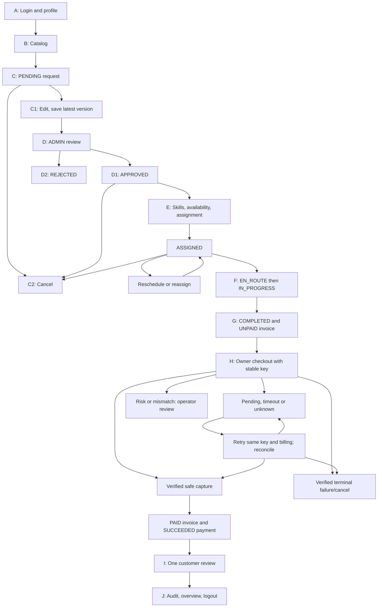

# FieldOps backend walkthrough and API test guide

## Start here

FieldOps helps a customer request a repair, lets an administrator dispatch a technician, and records completed work, invoices, verified payments, and feedback. This guide follows the implemented backend, not the earlier planning snippets.

- Live API: https://fieldops-api-xu3s.onrender.com/api/v1
- Repository: https://github.com/rafiferdos/fieldops-api
- API collection: https://raw.githubusercontent.com/rafiferdos/fieldops-api/main/docs/fieldops.postman_collection.json
- Executed checks: https://github.com/rafiferdos/fieldops-api/blob/main/docs/manual-verification.md
- Current scope: 39 domain routes, 2 health routes and 1 provider browser-return template. Role logins and return outcomes produce 46 main request examples. The historical fixture walkthrough below predates the authorized delivery extension.

**Read this once:** examples are not a reset button. A successful write changes state and version. Use GET before a write. For a fresh end-to-end run, create a new request and replace IDs with the IDs returned by your own calls. The prepared IDs below are independent shortcuts, not one connected workflow.

### Who does what

- CUSTOMER: own profile, own requests/work, own checkout, and one review after payment.
- TECHNICIAN: assigned work, progress, and completion.
- ADMIN: catalog, review, dispatch, account access, audit history, and finance overview. Manager and finance duties are included here.
- Public: health, catalog reads, authentication, and provider callbacks.

## How a backend call moves

1. Nest receives the request under /api/v1. It applies security headers, CORS, body parsing, and rate limits.
2. For a protected route, the access guard verifies the JWT and checks the current database session and account. A role guard checks the allowed role.
3. The Zod pipe checks body, query and IDs. Unknown client fields are rejected on strict application inputs. Provider callbacks can contain additional fields, but only allowlisted identifiers influence verification.
4. A controller passes validated input to its domain service. The service checks ownership, current state, and any supplied version.
5. PrismaService uses PostgreSQL transactions and locks for protected changes. Related domain changes and audit writes succeed together or roll back together.
6. The response uses one success/error shape. Private fields are never returned. Redis caches public catalog data only; failure falls back to PostgreSQL.

Provider calls happen outside retryable database transactions. Money and access are always decided from PostgreSQL and verified provider facts.

## Apidog setup in five minutes

1. Import the canonical Postman collection into the existing Default module. The route stays one endpoint; choose a named example/debug case when you want a different input.
2. Use Testing Env. Set its Base URL to the live API above; no trailing slash. If localhost is needed, use the PORT printed by your server/.env, for example http://localhost:3001/api/v1. The original generated default was 3000.
3. Use Cloud Proxy for the hosted API if the browser cannot send directly. Put passwords, access/refresh tokens, Google credentials, and provider references in Local Value only. Leave shared secret values empty.
4. Login separately for CUSTOMER, ADMIN and TECHNICIAN. Copy the correct returned token to its role variable. Access tokens last up to 15 minutes.
5. Send one case at a time. Check method, URL, role, Body mode, and expected result before Send. Never run the whole collection as one batch.

### Headers and body rules

- Protected calls: Authorization: Bearer followed by the role token. In Apidog use Auth → Bearer Token and the variable, not a second duplicate Authorization header.
- JSON writes: Body → JSON; Content-Type: application/json.
- Provider notifications: Body → x-www-form-urlencoded; keys tran_id and optional val_id. JSON is also supported.
- Checkout only: Headers → Idempotency-Key. It is not a JSON body field.
- GET, DELETE and logout: no body. Use Params for query values, Path for IDs and Auth for tokens. Do not add a fake body just to fill the editor.
- In JSON, version must be a number. Correct: "version": 2. Incorrect: "version": "2". The unquoted version variable in the collection resolves to a number.

### Your private variables

- customer_email/customer_password: existing dedicated demo customer, or your own new customer for a fresh workflow.
- admin_email/admin_password: existing dedicated administrator.
- technician_email/technician_password: existing seeded technician.
- access_token/admin_access_token/technician_access_token: each login's data.accessToken.
- refresh_token: current CUSTOMER data.refreshToken. Never overwrite it with an admin/technician refresh token by mistake.
- registration_email/registration_password: a new customer identity and a new private password, 15–128 characters. Example email shape: nadia.fieldops.test.20261008@example.com; choose a unique value for a real registration. Password examples are deliberately not published.
- google_credential: fresh real Google ID token. merchant_tran_id/validation_id: real sandbox identifiers, only if replaying provider callbacks.
- other_customer_access_token: a second customer for ownership tests. other_technician_access_token/other_technician_id: an unassigned second technician for reassignment/access tests.
- managed_access_token/managed_refresh_token: disposable access-test account only. old_access_token/old_refresh_token: disposable old values used for revocation/replay tests.

### Values to copy after successful calls

- Create service: data.id → service_id.
- Register/login: data.id (registration) or data.user.id (login) → customer_id; login access/refresh values → the matching Local Values.
- Create/edit/review/cancel request: data.id → request_id; data.version → request_version.
- Assign work: data.id → work_order_id; data.version → work_order_version; data.request.version → request_version. Assignment increases the request version too.
- Reschedule/progress/complete: data.version → work_order_version.
- Complete: data.invoice.id → invoice_id.
- Checkout: data.id → payment_id. Save the exact key and billing used for this attempt.
- Feedback: data.id → feedback_id.

## Real fixture data

These records were captured on October 8, 2026. Read them again before use; state and versions can change. Use the original demo customer credentials for owned fixture records. A different customer correctly gets 404.


```json
{
  "service_id": "78eaee1f-6547-41f0-894f-bdf692c077df",
  "customer_id": "6c63a08d-bdd8-4801-a7e7-fab3a45a072f",
  "technician_id": "a961caab-820a-4f41-b113-a1ffed66dbfd",
  "pending_request_id": "de15aadb-d830-4e8b-bf34-523afb463cc0",
  "approved_request_id": "e17bf857-51a6-44a8-bc95-e3e833dd5c7c",
  "assigned_work_order_id": "12f35f28-93e9-4b94-8139-6dd7efac1de5",
  "in_progress_work_order_id": "8064ff4b-5ce6-4e52-962e-a476f5d360f5",
  "unpaid_invoice_id": "f4ab512d-3c18-4161-a346-aa271e0e6c58",
  "paid_invoice_id": "cc4e24cc-a6fa-472b-83ea-ae4c2223e9b6",
  "settled_payment_id": "ae3180f2-b4a4-41dd-861a-242be085772b",
  "completed_work_order_id": "41e5edd5-d1f1-4ac8-b7f2-538fbcc40d1c",
  "managed_user_id": "2de62018-d7ab-4564-8150-736fbcfb3a91",
  "managed_user_email": "fieldops-managed-433efd83@example.com",
  "missing_id": "11111111-1111-4111-8111-111111111111"
}
```

- pending_request_id: PENDING, last captured version 2; edit/review shortcut.
- approved_request_id: APPROVED, last captured version 2; assignment shortcut.
- assigned_work_order_id: ASSIGNED, last captured version 2; reschedule/progress shortcut.
- in_progress_work_order_id: IN_PROGRESS, last captured version 3; completion shortcut.
- unpaid_invoice_id: UNPAID, amountMinor 150000; checkout shortcut.
- paid_invoice_id and settled_payment_id: earlier PAID/SUCCEEDED pair for reads and duplicate/late callback verification.
- completed_work_order_id: already paid and already reviewed; feedback replay returns 409.
- managed_user_id: disposable CUSTOMER, left ACTIVE after verification.
- missing_id: intentionally nonexistent example; verify it is still absent.

Main collection defaults point request_id to the PENDING shortcut, work_order_id to the ASSIGNED shortcut, invoice_id to the UNPAID shortcut, and payment_id to the earlier settled payment. They are independent. Replace them as you progress through one fresh workflow.

### Copyable contact, address and scheduling input


```json
{
  "name": "Demo Customer",
  "phone": "+8801712345678",
  "description": "The AC runs but does not cool the room. Please inspect it.",
  "address": "House 12, Road 3, Dhanmondi, Dhaka",
  "preferredStart": "2026-11-02T10:00:00+06:00",
  "visitStart": "2026-11-02T10:00:00+06:00",
  "visitEnd": "2026-11-02T11:00:00+06:00",
  "rescheduleStart": "2026-11-03T10:00:00+06:00",
  "rescheduleEnd": "2026-11-03T11:00:00+06:00",
  "billing": {
    "address": "House 12, Road 3",
    "city": "Dhaka",
    "postcode": "1209"
  }
}
```

These are sample contact details, not a person's verified phone/address. Change dates to a future free window when needed. Use timezone offsets; visits must last no more than eight hours. At most three fractional-second digits are accepted for scheduling. In the Params editor let Apidog encode + as %2B.

## How the records connect

Service → ServiceRequest → WorkOrder → Invoice → PaymentAttempt → PaymentReceipt. Feedback belongs to the WorkOrder. AuditLog records important changes.

- Service is the public catalog item and current price.
- ServiceRequest records the customer, chosen service, address and preferred time. Its review status is separate from work progress.
- WorkOrder records the assigned technician, actual visit window, agreed price snapshot, progress and final report.
- Invoice records the frozen customer/work/amount/currency. Completion creates it once.
- PaymentAttempt records one checkout intent. PaymentReceipt records provider-verified bank transaction evidence. One safe settlement pays the invoice.
- Feedback is one immutable customer review after completed, paid work.
- Session stores current login validity. A signed JWT alone never bypasses a revoked session or suspended account.

The request remains APPROVED while its work order advances through ASSIGNED, EN_ROUTE, IN_PROGRESS and COMPLETED. Check the work-order status to display repair progress.

## A to J: the complete workflow and every main branch




```text
A: health → login/profile → B: catalog → C: create PENDING request
C1: edit PENDING → review
C2: cancel PENDING → CANCELLED, stop this branch
D1: ADMIN APPROVE → APPROVED → E: dispatch
D2: ADMIN REJECT + reason → REJECTED, stop this branch
D3: cancel APPROVED before work starts → CANCELLED, stop this branch
E: skills → availability → assign → ASSIGNED work (request remains APPROVED)
E1: reschedule/reassign while ASSIGNED → new version, same price
E2: cancel while ASSIGNED → request + work CANCELLED; slot released
E3: booking conflict → 409; choose another slot/technician after GET
F: assigned TECHNICIAN EN_ROUTE → IN_PROGRESS
F1: skipped/repeated/backward step → 409
F2: cancellation or reschedule after start → 409
G: complete → COMPLETED + one UNPAID invoice
G1: identical completion retry → 200, same invoice
G2: changed report or wrong version → 409
H: owner checkout + stable key → provider checkout
H1: verified safe capture → SUCCEEDED payment + PAID invoice
H2: verified terminal failure/cancel → invoice remains UNPAID; new intent may use new key
H3: timeout/pending/unknown → keep same key; recover existing attempt
H4: mismatch/risk/additional capture → review; do not treat as a normal new charge
I: COMPLETED + PAID + no review hold → customer feedback → 201
I1: duplicate/unfinished/unpaid/held feedback → 409
J: ADMIN audit + overview → verify one financial event; then logout
J1: disposable account suspension → tokens/login 401
J2: reactivation → old tokens still 401; fresh login 200
```

### Fresh successful run: do these in order

1. A: GET /health and /health/ready. Login all three roles. PATCH the customer profile with the sample phone.
2. B: ADMIN creates a new service at 150000 paisa, saves service_id, updates its description, and reads it. Keep a second disposable service for deletion tests.
3. C: CUSTOMER creates a request using the sample body. Save request_id/version. Edit the address once and save the returned version.
4. D: ADMIN reviews with APPROVE and the current version. Save the new version. For REJECT/cancel tests, create separate requests from the same valid request body.
5. E: ADMIN sets technician skills. This replaces the complete skill set: keep any other skills needed by existing work. Search a future window, then assign. Save work ID/version and request.version.
6. E1 (optional): reschedule/reassign while ASSIGNED. Save the new work version. Do not cancel this main workflow.
7. F: assigned TECHNICIAN sends EN_ROUTE, saves version, then IN_PROGRESS and saves version. ADMIN/customer cannot make these progress calls.
8. G: assigned TECHNICIAN completes with a report. Save invoice_id. Read the invoice: UNPAID, 150000, BDT. Replay the exact completion if desired; the invoice ID must stay the same.
9. H: CUSTOMER sends the checkout billing with a new valid Idempotency-Key. Save payment_id and open the returned real sandbox checkoutUrl. Use the test-payment options displayed by SSLCommerz, not a fabricated success callback.
10. H1: after provider flow, GET payment and invoice. Success requires SUCCEEDED plus PAID, with verified/settled dates. A redirect, 200 callback acknowledgement or PENDING response is not enough.
11. I: CUSTOMER posts rating/comment once. GET work detail: feedback is present. Duplicate returns 409.
12. J: ADMIN checks the work/invoice/payment audit events and overview. Log out disposable sessions last. Read profile with the old token: 401.

### Request branches: use separate records

- C1 edit: GET PENDING, PATCH latest version + address, expect 200/version increased. Replay the old version → 409. Re-read; first edit is retained.
- C2 cancel: create a separate PENDING request, cancel using its current request version and reason → 200/CANCELLED. Review, edit or assign it afterward → 409 when state is otherwise valid.
- D2 reject: create another PENDING request, ADMIN sends REJECT + reason → 200/REJECTED. Missing reason → 400. A terminal rejection cannot be edited/reviewed/assigned again.
- D3 cancel approved without work: create, approve, then CUSTOMER or ADMIN cancels using latest request version → 200/CANCELLED.
- E2 cancel assigned: create, approve and assign a separate request. Use the new data.request.version to cancel. Both request/work become CANCELLED; check detail and availability. The retained work history is not deleted. A replacement requires a new request.
- F2 attempted late cancel: after EN_ROUTE, use latest request version to cancel → 409. Work remains started and request remains APPROVED.

### Scheduling branches

- Same technician + overlapping active visits: second assignment → 409; one valid booking remains.
- Same technician + exact adjacency: second visit starts exactly when the first ends → 201 if otherwise eligible.
- Different qualified technicians: same time window can succeed for both.
- Unskilled technician → 409. Missing/deleted/suspended/wrong-role technician during assignment → 404. Invalid/past/overlong window → 400.
- Reassign while ASSIGNED: second technician must have the skill and free slot. Version increments; price stays frozen; old technician reads/updates → 404.
- Reschedule conflict: original time/technician/price remain unchanged after 409.
- Clearing skills while active work depends on one → 409; idle technician can accept serviceIds:[], then restore before future assignment. Skill replacement is ADMIN-only.

### Payment branches

- New valid checkout → 201. Same invoice/key/billing → 200 and same payment ID. Reusing key with changed billing/invoice → 409.
- A different key while the invoice has an unresolved attempt → 409. Do not create a new key just because the network timed out.
- Timeout or invalid gateway initiation → 502 and UNKNOWN; a crash after initiation can retain INITIATING. Retry the same key/body. After 15 seconds the replay can reconcile the existing reference without starting another charge.
- Verified provider rejection or terminal failure/cancel can allow a new intent/new key; invoice stays UNPAID. Old key still points to its old attempt.
- Successful verified capture settles once. Replay IPN/success and late fail/cancel → acknowledgement without reversing payment or counting revenue twice.
- Invalid/mismatched provider validation → 502 or a review state as determined by validated facts; never mark the invoice paid from client input.
- High risk, mismatched amount/currency, reused provider identity, or additional capture needs operator review. A later extra capture may preserve the original SUCCEEDED/PAID settlement and set requiresReview=true. There is no review-approval/refund endpoint in this scope.
- PAID invoice + new key → 409. The original settled key can still retrieve its original attempt.
- Acknowledged callback can still be pending. Always read the payment AND invoice. Public callbacks never expose customer/merchant details.

### Session and account branches

- Successful login → access token + one-use refresh token. Valid rotation → replace both values. Old refresh replay → 401 and revokes that family; even its latest tokens then fail.
- Logout → 200; subsequent old-token profile → 401.
- Google: real verified credential → 200; forged/expired/wrong audience → 401. Existing unlinked email may return 409; do not auto-link it. Configuration unavailable → 503. Wrong encoding → 415; explicit untrusted Origin → 403.
- Disposable account ACTIVE update when already ACTIVE → 200/no-op; its session remains valid.
- Suspend disposable account → 200; its old access/refresh and password login → 401. Reactivate → 200; old tokens remain 401; fresh login/profile → 200. Leave it ACTIVE.
- Actual role changes revoke sessions too. Technician with active work cannot change role → 409. Idle role change away from TECHNICIAN removes obsolete skills while retaining history.
- Last active ADMIN cannot be demoted/suspended → 409. Test this in an isolated database with controlled accounts, not by risking demo access.

## Every endpoint: exact input and focused cases

The default input below is a working shape. MANUAL cases are expectations, not claims that this guide executed them. ACTUAL response examples in the collection are sanitized historical live captures. For a conflict case, meet its setup first; otherwise an earlier guard/validation may correctly return a different error.

## 01 Health

### Liveness


```text
GET {{base_url}}/health
```

Auth: none. Expected normal success: 200.

No authentication or body. 200 means the process can answer; use readiness to check PostgreSQL too.

Body: none.

Contract: Access: PUBLIC. Expected success: 200.

Liveness does not query PostgreSQL.

### Database readiness


```text
GET {{base_url}}/health/ready
```

Auth: none. Expected normal success: 200.

No authentication or body. 200 with database=up is ready. A real database outage returns 503; test that only in an isolated environment.

Body: none.

Contract: Access: PUBLIC. Expected success: 200.

Checks PostgreSQL. Database outage returns 503.

## 02 Authentication

### Register customer


```text
POST {{base_url}}/auth/register
```

Auth: none. Expected normal success: 201.

Choose a unique registration_email and a private registration_password. Success creates a CUSTOMER only; copy data.id. To use this new account, copy its credentials into customer_email/customer_password and log in. Existing fixture IDs belong to the earlier demo customer and are not visible to a newly registered account.

Body → JSON:

```json
{
  "name": "Nadia Test Customer",
  "email": "{{registration_email}}",
  "password": "{{registration_password}}"
}
```

Contract: Access: PUBLIC. Expected success: 201.

Name 2–100 trimmed characters; normalized email up to 254; password 15–128 characters. Registration creates a CUSTOMER profile; log in separately for tokens. Client role/phone/extra fields are rejected. Existing reserved email returns 409.

**T001: Duplicate registered email → 409**

Setup: Use customer_email of the existing demo customer.


```json
{
  "name": "Duplicate Test",
  "email": "{{customer_email}}",
  "password": "{{registration_password}}"
}
```

Check: No second account is created.

**T002: Public role escalation → 400**

Setup: Use a unique email and a valid private password.


```json
{
  "name": "Role Test",
  "email": "{{registration_email}}",
  "password": "{{registration_password}}",
  "role": "ADMIN"
}
```

Check: No privileged account is created.

**T003: Short registration password → 400**

Setup: Use a new test email.


```json
{
  "name": "Nadia Test Customer",
  "email": "{{registration_email}}",
  "password": "short"
}
```

Check: Registration requires 15–128 characters.

**T004: Invalid email and short name → 400**

Setup: No account setup needed.


```json
{
  "name": "N",
  "email": "not-an-email",
  "password": "{{registration_password}}"
}
```

### Login customer


```text
POST {{base_url}}/auth/login
```

Auth: none. Expected normal success: 200.

Use the existing demo customer for the prepared fixture IDs. Copy data.accessToken to access_token and data.refreshToken to refresh_token. Copy data.user.id to customer_id. Never paste tokens into a shared example.

Body → JSON:

```json
{
  "email": "{{customer_email}}",
  "password": "{{customer_password}}"
}
```

Contract: Access: PUBLIC. Expected success: 200.

Log in with an active CUSTOMER account. Prepare admin/technician via safe bootstrap scripts; public registration cannot choose roles. Extract accessToken/refreshToken into local environment values, never shared values. Generic credential/account failure returns 401.

**T005: Incorrect password → 401**

Setup: Use an existing account; send one deliberate wrong-password attempt.


```json
{
  "email": "{{customer_email}}",
  "password": "this-is-deliberately-incorrect"
}
```

Check: Generic authentication error; no tokens.

**T006: Invalid email shape → 400**

Setup: No state change.


```json
{
  "email": "not-an-email",
  "password": "wrong"
}
```

### Login admin


```text
POST {{base_url}}/auth/login
```

Auth: none. Expected normal success: 200.

Use the dedicated administrator credentials already in your private Local Values. Copy data.accessToken to admin_access_token. Public registration cannot create an administrator.

Body → JSON:

```json
{
  "email": "{{admin_email}}",
  "password": "{{admin_password}}"
}
```

Contract: Access: PUBLIC. Expected success: 200.

Log in with an active ADMIN account. Prepare admin/technician via safe bootstrap scripts; public registration cannot choose roles. Extract accessToken/refreshToken into local environment values, never shared values. Generic credential/account failure returns 401.

**T007: Incorrect password → 401**

Setup: Use an existing account; send one deliberate wrong-password attempt.


```json
{
  "email": "{{admin_email}}",
  "password": "this-is-deliberately-incorrect"
}
```

Check: Generic authentication error; no tokens.

**T008: Invalid email shape → 400**

Setup: No state change.


```json
{
  "email": "not-an-email",
  "password": "wrong"
}
```

### Login technician


```text
POST {{base_url}}/auth/login
```

Auth: none. Expected normal success: 200.

Use the seeded technician credentials in Local Values. Copy data.accessToken to technician_access_token and data.user.id to technician_id.

Body → JSON:

```json
{
  "email": "{{technician_email}}",
  "password": "{{technician_password}}"
}
```

Contract: Access: PUBLIC. Expected success: 200.

Log in with an active TECHNICIAN account. Prepare admin/technician via safe bootstrap scripts; public registration cannot choose roles. Extract accessToken/refreshToken into local environment values, never shared values. Generic credential/account failure returns 401.

**T009: Incorrect password → 401**

Setup: Use an existing account; send one deliberate wrong-password attempt.


```json
{
  "email": "{{technician_email}}",
  "password": "this-is-deliberately-incorrect"
}
```

Check: Generic authentication error; no tokens.

**T010: Invalid email shape → 400**

Setup: No state change.


```json
{
  "email": "not-an-email",
  "password": "wrong"
}
```

### Verified Google login


```text
POST {{base_url}}/auth/google
```

Auth: none. Expected normal success: 200.

Get a fresh Google ID token using npm run google:test and your configured OAuth client. Send JSON through an allowed origin or the Apidog proxy without an Origin header. A made-up credential cannot test successful Google login.

Body → JSON:

```json
{
  "credential": "{{google_credential}}"
}
```

Contract: Access: PUBLIC. Expected success: 200.

Use a real Google ID token obtained through npm run google:test and the configured OAuth client. The server verifies signature/audience/issuer/expiry/email and binds provider subject. Disabled Google configuration 503; invalid credential 401; existing unlinked email 409; non-JSON/untrusted origin 415/403. This example does not fabricate a Google credential.

**T011: Forged Google credential → 401**

Setup: Google must be configured; use JSON.


```json
{
  "credential": "not-a-real-google-id-token"
}
```

**T012: Google request uses wrong encoding → 415**

Setup: Send the credential as text/plain.


```text
Content-Type: text/plain
```


```text
not-a-real-google-id-token
```

**T013: Google request has untrusted origin → 403**

Setup: Use JSON with a deliberately untrusted Origin.


```text
Origin: https://untrusted.example.com
```


```json
{
  "credential": "not-a-real-google-id-token"
}
```

### Rotate refresh token


```text
POST {{base_url}}/auth/refresh
```

Auth: none. Expected normal success: 200.

Use a disposable session for replay tests. Replace BOTH access and refresh values after success. Save the previous refresh value separately only for the replay branch. A replay revokes the entire session family.

Body → JSON:

```json
{
  "refreshToken": "{{refresh_token}}"
}
```

Contract: Access: PUBLIC. Expected success: 200.

Refresh token is a 43-character URL-safe opaque value. Use it once and replace the saved refresh token with the returned token. Replay revokes its session family and returns 401.

**T014: Malformed refresh token → 400**

Setup: No setup.


```json
{
  "refreshToken": "short"
}
```

**T015: Unknown but well-shaped refresh token → 401**

Setup: 43 URL-safe characters; this value is not a real token.


```json
{
  "refreshToken": "AAAAAAAAAAAAAAAAAAAAAAAAAAAAAAAAAAAAAAAAAAA"
}
```

**T016: Replay old refresh token → 401**

Setup: Create a disposable login, save old_refresh_token, rotate it once successfully, then run this.


```json
{
  "refreshToken": "{{old_refresh_token}}"
}
```

Check: Newest access and refresh from that family must subsequently fail too. Log in again.

### Logout current session


```text
POST {{base_url}}/auth/logout
```

Auth: Bearer {{access_token}}. Expected normal success: 200.

Run this last for the selected role. This request has no body. Then call GET /users/me with the same token; expect 401.

Body: none.

Contract: Access: CUSTOMER. Expected success: 200.

Allowed for CUSTOMER/TECHNICIAN/ADMIN with the corresponding token. Revokes the current session; run after other requests for that session.

**T017: Logout revoked session → 401**

Setup: Log out a disposable session once, then repeat with its old access token.


```text
Auth: Bearer {{old_access_token}}
```

## 03 Profile

### Read own profile


```text
GET {{base_url}}/users/me
```

Auth: Bearer {{access_token}}. Expected normal success: 200.

There is no body. Use customer, technician or admin Bearer token. Check the returned user.id and role match that token.

Body: none.

Contract: Access: CUSTOMER. Expected success: 200.

Any authenticated primary role may read its own safe profile. Switch the Bearer variable for technician/admin.

**T018: Missing Bearer token → 401**

Setup: Remove authorization.


```text
Auth: none
```

**T019: Expired or revoked access token → 401**

Setup: Use a disposable token after logout, suspension, refresh replay, or its actual expiry.


```text
Auth: Bearer {{old_access_token}}
```

### Update own profile


```text
PATCH {{base_url}}/users/me
```

Auth: Bearer {{access_token}}. Expected normal success: 200.

A phone is required before checkout. The example number is test contact data. Use an international number beginning with +; phone:null clears it.

Body → JSON:

```json
{
  "name": "Demo Customer",
  "phone": "+8801712345678"
}
```

Contract: Access: CUSTOMER. Expected success: 200.

Allowlisted name/phone only; at least one field. Name 2–100 characters. Phone uses international format; null clears it. Cannot update role/status/email/password. Payment checkout requires a valid phone and name/email at most 50 characters.

**T020: Clear phone → 200**

Setup: Owner login. This affects checkout; restore the sample international phone afterward.


```json
{
  "phone": null
}
```

Check: phone is null; checkout must reject missing contact with 409.

**T021: Empty profile update → 400**

Setup: Owner login.


```json
{}
```

**T022: Invalid phone → 400**

Setup: Owner login.


```json
{
  "phone": "01712345678"
}
```

**T023: Forbidden profile fields → 400**

Setup: Owner login.


```json
{
  "role": "ADMIN",
  "email": "changed@example.com"
}
```

## 04 Service catalog

### Search active services


```text
GET {{base_url}}/services?page=1&limit=20&sort=newest
```

Auth: none. Expected normal success: 200.

Use the Params editor for q, page, limit and sort. A GET request has no body. Example q=Cooling, page=1, limit=10, sort=price_asc.

Body: none.

Contract: Access: PUBLIC. Expected success: 200.

Public catalog only; soft-deleted services excluded. Public data may use Redis; outage falls back to PostgreSQL.

**T024: Search and sort → 200**

Setup: Public request.


```text
GET {{base_url}}/services?q=Cooling&page=1&limit=10&sort=price_asc
```

Check: Each result matches the literal search; pagination is consistent.

**T025: Empty search result → 200**

Setup: Use a deliberately unique q.


```text
GET {{base_url}}/services?q=does-not-exist-fieldops-guide-984230&page=1&limit=20
```

Check: items is empty; this is not a 404.

**T026: Invalid page or limit → 400**

Setup: Public request.


```text
GET {{base_url}}/services?page=0&limit=101
```

**T027: Unknown query field → 400**

Setup: Public request.


```text
GET {{base_url}}/services?includeDeleted=true
```

### Read active service


```text
GET {{base_url}}/services/{{service_id}}
```

Auth: none. Expected normal success: 200.

Default service_id is a real retained service. Read it before creating a request. For the fresh flow, replace service_id after creating your own service.

Body: none.

Contract: Access: PUBLIC. Expected success: 200.

Active public service. Invalid UUID 400; missing/deleted service 404.

**T028: Invalid UUID → 400**

Setup: Public request.


```text
GET {{base_url}}/services/not-a-uuid
```

**T029: Missing or deleted service → 404**

Setup: Use missing_id; verify it has not been created.


```text
GET {{base_url}}/services/{{missing_id}}
```

### Create service


```text
POST {{base_url}}/services
```

Auth: Bearer {{admin_access_token}}. Expected normal success: 201.

150000 means BDT 1,500.00. Currency is set by the server. Copy data.id to service_id if using this new service for the full flow. Keep deletion tests on a separate disposable service.

Body → JSON:

```json
{
  "name": "Cooling unit inspection",
  "description": "Inspect and repair the cooling unit.",
  "basePriceMinor": 150000
}
```

Contract: Access: ADMIN. Expected success: 201.

Name 2–100, description 10–2000 trimmed characters; price integer 0–1000000000 paisa; BDT fixed by server. Extract data.id as service_id. Audit/cache revision update is atomic. SSLCommerz checkout supports only BDT 10–500000; unsupported invoice amounts return 409.

**T030: Customer cannot create catalog entries → 403**

Setup: Valid customer token and valid body.


```text
Auth: Bearer {{access_token}}
```

**T031: Invalid price or too-short fields → 400**

Setup: ADMIN login.


```json
{
  "name": "A",
  "description": "short",
  "basePriceMinor": -1
}
```

**T032: Client-selected currency → 400**

Setup: ADMIN login.


```json
{
  "name": "Test service",
  "description": "A separate test service for validation.",
  "basePriceMinor": 150000,
  "currency": "USD"
}
```

### Update service


```text
PATCH {{base_url}}/services/{{service_id}}
```

Auth: Bearer {{admin_access_token}}. Expected normal success: 200.

At least one allowed field is required. A later price change affects future assignments, not an already assigned price or an issued invoice.

Body → JSON:

```json
{
  "description": "Inspect, clean and repair the cooling unit."
}
```

Contract: Access: ADMIN. Expected success: 200.

At least one name/description/basePriceMinor field; same bounds as creation. Historical agreed prices and invoices stay frozen.

**T033: Update future price → 200**

Setup: Use your disposable test service; do not change the shared fixture unless intended.


```json
{
  "basePriceMinor": 175000
}
```

Check: Already assigned work and existing invoices retain their prior price.

**T034: Empty catalog update → 400**

Setup: ADMIN login.


```json
{}
```

**T035: Missing catalog record → 404**

Setup: ADMIN login and valid body.


```text
PATCH {{base_url}}/services/{{missing_id}}
```

### Soft-delete service


```text
DELETE {{base_url}}/services/{{service_id}}
```

Auth: Bearer {{admin_access_token}}. Expected normal success: 200.

There is no DELETE body. Create a separate disposable service and put its ID in the path. After deletion, GET that ID must return 404. Do not delete the shared service used by the prepared fixtures.

Body: none.

Contract: Access: ADMIN. Expected success: 200.

Run after creating the service/request/work fixtures. Soft deletion preserves historical work/invoices/feedback; public reads return 404.

**T036: Customer cannot delete catalog entries → 403**

Setup: Use a disposable service ID and CUSTOMER token.


```text
Auth: Bearer {{access_token}}
```

**T037: Repeat delete on deleted ID → 404**

Setup: Delete your own disposable service once, keep its ID, then repeat.

Send the main request above after meeting this setup.

Check: Public detail stays 404; retained financial history is unchanged.

## 05 Service requests

### Create customer request


```text
POST {{base_url}}/requests
```

Auth: Bearer {{access_token}}. Expected normal success: 201.

Use the demo customer or your own fresh customer. Copy data.id to request_id and data.version to request_version. Use a future preferred_start; dates printed here eventually become stale.

Body → JSON:

```json
{
  "serviceId": "{{service_id}}",
  "description": "The AC runs but does not cool the room. Please inspect it.",
  "address": "House 12, Road 3, Dhanmondi, Dhaka",
  "preferredStart": "{{preferred_start}}"
}
```

Contract: Access: CUSTOMER. Expected success: 201.

Active service UUID, description 10–2000, address 10–500 trimmed characters, future ISO time with timezone offset. Owner is taken from session. Extract data.id and data.version as request_id/request_version.

**T038: Client-selected owner → 400**

Setup: CUSTOMER login.


```json
{
  "serviceId": "{{service_id}}",
  "description": "The AC runs but does not cool the room. Please inspect it.",
  "address": "House 12, Road 3, Dhanmondi, Dhaka",
  "preferredStart": "{{preferred_start}}",
  "customerId": "{{managed_user_id}}"
}
```

**T039: Past preferred date → 400**

Setup: CUSTOMER login.


```json
{
  "serviceId": "{{service_id}}",
  "description": "The AC runs but does not cool the room. Please inspect it.",
  "address": "House 12, Road 3, Dhanmondi, Dhaka",
  "preferredStart": "2000-01-01T10:00:00Z"
}
```

**T040: Missing service → 404**

Setup: CUSTOMER login and future preferred_start.


```json
{
  "serviceId": "{{missing_id}}",
  "description": "The AC runs but does not cool the room. Please inspect it.",
  "address": "House 12, Road 3, Dhanmondi, Dhaka",
  "preferredStart": "{{preferred_start}}"
}
```

**T041: Technician cannot create a customer request → 403**

Setup: Technician login and valid body.


```text
Auth: Bearer {{technician_access_token}}
```

**T042: Too-short description or address → 400**

Setup: CUSTOMER login.


```json
{
  "serviceId": "{{service_id}}",
  "description": "short",
  "address": "short",
  "preferredStart": "{{preferred_start}}"
}
```

### List scoped requests


```text
GET {{base_url}}/requests?page=1&limit=20&sort=newest
```

Auth: Bearer {{access_token}}. Expected normal success: 200.

Customer sees their own requests; ADMIN sees all retained requests. Example filters: status=PENDING, serviceId={{service_id}}, q=AC, sort=preferred_start_asc. No request body.

Body: none.

Contract: Access: CUSTOMER. Expected success: 200.

C own / A all active requests; TECHNICIAN 403. Status PENDING/APPROVED/REJECTED/CANCELLED; literal search checks description/address/service name. Unrelated customer sees an empty list.

**T043: Filter pending owned requests → 200**

Setup: CUSTOMER login.


```text
GET {{base_url}}/requests?status=PENDING&serviceId={{service_id}}&q=AC&page=1&limit=10&sort=preferred_start_asc
```

Check: No records owned by another customer. ADMIN may repeat with the admin token.

**T044: Technician cannot list customer requests → 403**

Setup: Technician login.


```text
Auth: Bearer {{technician_access_token}}
```

**T045: Invalid request status → 400**

Setup: CUSTOMER login.


```text
GET {{base_url}}/requests?status=COMPLETED
```

**T046: Another customer list is scoped → 200**

Setup: Log in a second customer, not the fixture owner.


```text
Auth: Bearer {{other_customer_access_token}}
```

Check: The fixture request is absent; an empty list is valid.

### Read scoped request


```text
GET {{base_url}}/requests/{{request_id}}
```

Auth: Bearer {{access_token}}. Expected normal success: 200.

Read current status and version before any write. Save data.version. Its workOrder is null before assignment.

Body: none.

Contract: Access: CUSTOMER. Expected success: 200.

C own / A. Foreign/missing/soft-deleted request 404; T 403. Nullable work summary includes its current invoice/feedback.

**T047: Another customer cannot read this request → 404**

Setup: Use a second customer token and the first customer request ID.


```text
Auth: Bearer {{other_customer_access_token}}
```

**T048: Missing request → 404**

Setup: CUSTOMER or ADMIN login.


```text
GET {{base_url}}/requests/{{missing_id}}
```

**T049: Malformed request ID → 400**

Setup: Valid CUSTOMER token.


```text
GET {{base_url}}/requests/not-a-uuid
```

### Edit pending request


```text
PATCH {{base_url}}/requests/{{request_id}}
```

Auth: Bearer {{access_token}}. Expected normal success: 200.

Get the current request first. version is a JSON number, not a quoted string. After success, save the new data.version. You can edit only your own PENDING request.

Body → JSON:

```json
{
  "version": {{request_version}},
  "address": "House 25, Road 4, Dhaka"
}
```

Contract: Access: CUSTOMER. Expected success: 200.

Only owner and PENDING state. Send latest integer version (1–2147483646) plus at least one description/address/preferredStart. Extract returned version; stale version or ineligible state 409.

**T050: Empty edit except version → 400**

Setup: Read current request version.


```json
{
  "version": {{request_version}}
}
```

**T051: Replay an old request version → 409**

Setup: Successfully edit a disposable PENDING request once, then resend the previous numeric version.

Send the main request above after meeting this setup.

Check: Second mutation does not overwrite the first. GET latest state.

**T052: Edit after approval → 409**

Setup: Approve a separate request. GET its latest version before sending the edit.

Send the main request above after meeting this setup.

Check: The request stays APPROVED.

**T053: Edit another customer request → 404**

Setup: Second customer token; valid latest version and body.


```text
Auth: Bearer {{other_customer_access_token}}
```

**T054: Quoted version is invalid → 400**

Setup: Owner login.


```json
{
  "version": "2",
  "address": "House 25, Road 4, Dhaka"
}
```

### Review pending request


```text
PATCH {{base_url}}/requests/{{request_id}}/review
```

Auth: Bearer {{admin_access_token}}. Expected normal success: 200.

Use ADMIN and the latest request version. APPROVE continues to dispatch. REJECT needs a reason and ends that request branch. Use different requests for approval and rejection.

Body → JSON:

```json
{
  "version": {{request_version}},
  "decision": "APPROVE"
}
```

Contract: Access: ADMIN. Expected success: 200.

Decision APPROVE/REJECT with latest version. REJECT requires a 3–500-character reason. Only PENDING; stale version/state 409. Save latest version.

**T055: Reject with a clear reason → 200**

Setup: Use a separate PENDING request and latest version.


```json
{
  "version": {{request_version}},
  "decision": "REJECT",
  "reason": "Requested work is outside this service scope."
}
```

Check: Status becomes REJECTED; no work order or invoice is created.

**T056: Reject without reason → 400**

Setup: ADMIN login.


```json
{
  "version": {{request_version}},
  "decision": "REJECT"
}
```

**T057: Customer cannot review → 403**

Setup: Owner customer token and otherwise valid body.


```text
Auth: Bearer {{access_token}}
```

**T058: Review stale or non-pending request → 409**

Setup: Review once successfully, then use a stale version; separately use latest version on the approved/rejected request.

Send the main request above after meeting this setup.

Check: No second review changes the request.

### Cancel unstarted request


```text
POST {{base_url}}/requests/{{request_id}}/cancel
```

Auth: Bearer {{access_token}}. Expected normal success: 200.

Cancellation is a separate branch. Use a fresh PENDING/APPROVED request. If it has ASSIGNED work, both are cancelled together. Use data.version from the request, not the work order.

Body → JSON:

```json
{
  "version": {{request_version}},
  "reason": "Visit no longer needed."
}
```

Contract: Access: CUSTOMER. Expected success: 200.

C own / A. PENDING/APPROVED only; an ASSIGNED order is cancelled atomically. EN_ROUTE/IN_PROGRESS/COMPLETED cannot be cancelled (409). Test on a separate request; this is an alternative to the paid-work workflow.

**T059: Cancel approved assigned work → 200**

Setup: Use a separate APPROVED request with ASSIGNED work. GET current request version, not work version.

Send the main request above after meeting this setup.

Check: Request and work become CANCELLED together. The technician slot becomes free; no invoice.

**T060: Cancel started work → 409**

Setup: Use latest request version after work enters EN_ROUTE or IN_PROGRESS.

Send the main request above after meeting this setup.

Check: Work and request state remain unchanged.

**T061: Missing cancellation reason → 400**

Setup: Owner or ADMIN login.


```json
{
  "version": {{request_version}}
}
```

**T062: Cancel another customer request → 404**

Setup: Second customer token.


```text
Auth: Bearer {{other_customer_access_token}}
```

**T063: Cancel rejected or already-cancelled request → 409**

Setup: Use a separate terminal request and latest version.

Send the main request above after meeting this setup.

Check: Terminal state stays unchanged.

## 06 Technician dispatch

### Replace technician skills


```text
PUT {{base_url}}/technicians/{{technician_id}}/skills
```

Auth: Bearer {{admin_access_token}}. Expected normal success: 200.

This PUT replaces the entire set, not one added skill. Include every skill that must stay. Read the response serviceIds; keep skills required by active work.

Body → JSON:

```json
{
  "serviceIds": [
    "{{service_id}}"
  ]
}
```

Contract: Access: ADMIN. Expected success: 200.

Target must be a retained TECHNICIAN account; assignment separately requires ACTIVE status. serviceIds contains at most 100 unique active service UUIDs; [] clears skills unless active work depends on one. Removing a required skill returns 409. Use the technician profile ID, not a customer ID.

**T064: Duplicate skill ID → 400**

Setup: ADMIN login.


```json
{
  "serviceIds": [
    "{{service_id}}",
    "{{service_id}}"
  ]
}
```

**T065: Missing referenced service → 404**

Setup: ADMIN login.


```json
{
  "serviceIds": [
    "{{missing_id}}"
  ]
}
```

**T066: Clear idle technician skills → 200**

Setup: Use an idle dedicated technician with no active work that depends on a skill.


```json
{
  "serviceIds": []
}
```

Check: serviceIds becomes []; restore intended skills before assignment.

**T067: Remove a skill used by active work → 409**

Setup: Use a technician with ASSIGNED/EN_ROUTE/IN_PROGRESS work for this service.


```json
{
  "serviceIds": []
}
```

Check: The original skill set remains intact.

**T068: Customer ID is not a technician → 404**

Setup: ADMIN login and a real CUSTOMER id.


```text
PUT {{base_url}}/technicians/{{customer_id}}/skills
```

### Find available technicians


```text
GET {{base_url}}/technicians?serviceId={{service_id}}&start={{visit_start}}&end={{visit_end}}&page=1&limit=20
```

Auth: Bearer {{admin_access_token}}. Expected normal success: 200.

Set serviceId/start/end in Params. Enter +06:00 normally; let Apidog encode the plus sign as %2B. This search does not reserve the slot. An empty list is valid 200.

Body: none.

Contract: Access: ADMIN. Expected success: 200.

Required serviceId/start/end. Future ISO times with offset and at most millisecond precision; end > start, visit at most 8 hours. Only active matching-skill technicians with no overlapping active visit are returned. This read does not reserve availability.

**T069: Reversed visit window → 400**

Setup: ADMIN login.


```text
GET {{base_url}}/technicians?serviceId={{service_id}}&start=2026-11-02T11:00:00%2B06:00&end=2026-11-02T10:00:00%2B06:00
```

**T070: Visit longer than eight hours → 400**

Setup: ADMIN login; choose future dates if these are stale.


```text
GET {{base_url}}/technicians?serviceId={{service_id}}&start=2026-11-02T01:00:00Z&end=2026-11-02T10:00:00Z
```

**T071: Missing scheduling parameters → 400**

Setup: ADMIN login.


```text
GET {{base_url}}/technicians?serviceId={{service_id}}
```

**T072: Booked technician is unavailable → 200**

Setup: Set start/end to an existing active booking for the technician.

Send the main request above after meeting this setup.

Check: That technician is excluded; another eligible technician may still appear.

### Assign approved request


```text
POST {{base_url}}/requests/{{request_id}}/assignment
```

Auth: Bearer {{admin_access_token}}. Expected normal success: 201.

ADMIN assigns one APPROVED request to an active skilled technician. Copy data.id to work_order_id, data.version to work_order_version, and data.request.version to request_version. The request stays APPROVED; the work becomes ASSIGNED.

Body → JSON:

```json
{
  "technicianId": "{{technician_id}}",
  "start": "{{visit_start}}",
  "end": "{{visit_end}}"
}
```

Contract: Access: ADMIN. Expected success: 201.

APPROVED request, active skilled technician and valid future window. Overlap/duplicate assignment/ineligible state 409. Price is snapshotted. Extract work_order_id, work_order_version and request.version as request_version.

**T073: Assign a pending request → 409**

Setup: Use a separate PENDING request.

Send the main request above after meeting this setup.

Check: No work order is created.

**T074: Duplicate assignment → 409**

Setup: Assign once successfully; repeat the same request.

Send the main request above after meeting this setup.

Check: There is one retained work order.

**T075: Overlapping active booking → 409**

Setup: Use a second APPROVED request and the same technician/time as an active booking.

Send the main request above after meeting this setup.

Check: First booking stays intact.

**T076: Adjacent booking is allowed → 201**

Setup: Use a second APPROVED request and set its start exactly to the existing booking end.

Send the main request above after meeting this setup.

Check: The two half-open visit windows do not overlap.

**T077: Missing skill → 409**

Setup: Use an active idle technician without the requested service skill.


```json
{
  "technicianId": "{{other_technician_id}}",
  "start": "{{visit_start}}",
  "end": "{{visit_end}}"
}
```

**T078: Wrong-role or missing technician → 404**

Setup: ADMIN login; CUSTOMER is not a technician.


```json
{
  "technicianId": "{{customer_id}}",
  "start": "{{visit_start}}",
  "end": "{{visit_end}}"
}
```

**T079: Client tries to select the price → 400**

Setup: ADMIN login.


```json
{
  "technicianId": "{{technician_id}}",
  "start": "{{visit_start}}",
  "end": "{{visit_end}}",
  "agreedPriceMinor": 1
}
```

## 07 Work orders

### List scoped work orders


```text
GET {{base_url}}/work-orders?page=1&limit=20&sort=newest
```

Auth: Bearer {{access_token}}. Expected normal success: 200.

Customer sees owned work, technician sees currently assigned work, ADMIN sees all. Example status=ASSIGNED, q=AC, sort=scheduled_start_asc. No body.

Body: none.

Contract: Access: CUSTOMER. Expected success: 200.

C own / assigned T / A. Status ASSIGNED/EN_ROUTE/IN_PROGRESS/COMPLETED/CANCELLED; serviceId and literal description/address/service-name search. Every item has safe nullable invoice/feedback.

**T080: Assigned technician list → 200**

Setup: Technician login.


```text
GET {{base_url}}/work-orders?status=ASSIGNED&page=1&limit=20&sort=scheduled_start_asc
Auth: Bearer {{technician_access_token}}
```

Check: Only work currently assigned to that technician.

**T081: Unknown query scope field → 400**

Setup: Any valid role token.


```text
GET {{base_url}}/work-orders?customerId={{customer_id}}
```

### Read scoped work order and timeline


```text
GET {{base_url}}/work-orders/{{work_order_id}}
```

Auth: Bearer {{access_token}}. Expected normal success: 200.

Save data.version. Read status, technician, request, nullable invoice/feedback, and the timeline. The timeline is chronological and limited to the latest 100 events.

Body: none.

Contract: Access: CUSTOMER. Expected success: 200.

C own / currently assigned T / A. Other customer/unassigned technician/soft-deleted request 404. Safe timeline returns latest 100 work-order events, chronologically. Feedback null until submission. Save latest work version.

**T082: Unrelated customer cannot read work → 404**

Setup: Second customer token.


```text
Auth: Bearer {{other_customer_access_token}}
```

**T083: Unassigned or former technician cannot read work → 404**

Setup: Use a different technician token or the former technician after reassignment.


```text
Auth: Bearer {{other_technician_access_token}}
```

**T084: Missing work order → 404**

Setup: Any valid role token.


```text
GET {{base_url}}/work-orders/{{missing_id}}
```

### Reschedule or reassign unstarted work


```text
PATCH {{base_url}}/work-orders/{{work_order_id}}/schedule
```

Auth: Bearer {{admin_access_token}}. Expected normal success: 200.

Only ASSIGNED work can move. Use the latest work_order_version and a future free slot. To reassign, choose a second skilled technician and verify the former technician loses access. Save returned data.version.

Body → JSON:

```json
{
  "version": {{work_order_version}},
  "technicianId": "{{technician_id}}",
  "start": "{{reschedule_start}}",
  "end": "{{reschedule_end}}"
}
```

Contract: Access: ADMIN. Expected success: 200.

Only ASSIGNED with APPROVED request. Latest version and valid skilled active technician/window; overlap 409. Reassignment removes former technician access; agreed price stays frozen. Save returned version.

**T085: Reassign to another skilled technician → 200**

Setup: Create/select another ACTIVE TECHNICIAN, give the service skill, and choose a free future window.


```json
{
  "version": {{work_order_version}},
  "technicianId": "{{other_technician_id}}",
  "start": "{{reschedule_start}}",
  "end": "{{reschedule_end}}"
}
```

Check: Technician changes, price stays frozen, version increases, former technician gets 404.

**T086: Reschedule after work starts → 409**

Setup: Read latest version on EN_ROUTE/IN_PROGRESS work.

Send the main request above after meeting this setup.

Check: Original visit remains unchanged.

**T087: Reschedule stale version → 409**

Setup: Reschedule once, then resend the previous numeric version.

Send the main request above after meeting this setup.

Check: GET shows only the first change.

**T088: Conflicting new slot → 409**

Setup: Use latest version and a slot occupied by another active visit for that technician.

Send the main request above after meeting this setup.

Check: Original slot and price are retained.

**T089: Technician cannot dispatch → 403**

Setup: Assigned technician token; otherwise valid body.


```text
Auth: Bearer {{technician_access_token}}
```

### Advance assigned technician progress


```text
PATCH {{base_url}}/work-orders/{{work_order_id}}/status
```

Auth: Bearer {{technician_access_token}}. Expected normal success: 200.

Send EN_ROUTE first. Save the returned version. Then change only status to IN_PROGRESS and send again with that version. Only the assigned technician can do this.

Body → JSON:

```json
{
  "version": {{work_order_version}},
  "status": "EN_ROUTE"
}
```

Contract: Access: TECHNICIAN. Expected success: 200.

Assigned T only. Explicit sequence ASSIGNED -> EN_ROUTE -> IN_PROGRESS. Send status EN_ROUTE first, then change to IN_PROGRESS with the returned latest version. Invalid/skipped transition/stale version 409; C/A 403.

**T090: Advance EN_ROUTE to IN_PROGRESS → 200**

Setup: First move ASSIGNED to EN_ROUTE and save the returned work version.


```json
{
  "version": {{work_order_version}},
  "status": "IN_PROGRESS"
}
```

Check: Status becomes IN_PROGRESS; save the new version.

**T091: Skip directly from ASSIGNED to IN_PROGRESS → 409**

Setup: Use a separate ASSIGNED work order and its latest version.


```json
{
  "version": {{work_order_version}},
  "status": "IN_PROGRESS"
}
```

Check: Work stays ASSIGNED.

**T092: Repeat or reverse progress → 409**

Setup: Use latest version on EN_ROUTE (repeat EN_ROUTE) or IN_PROGRESS (back to EN_ROUTE).

Send the main request above after meeting this setup.

Check: Progress never goes backward.

**T093: COMPLETED is not a progress input → 400**

Setup: Assigned technician login.


```json
{
  "version": {{work_order_version}},
  "status": "COMPLETED"
}
```

Check: Use the completion endpoint instead.

**T094: ADMIN cannot act as assigned technician → 403**

Setup: ADMIN token with otherwise valid body.


```text
Auth: Bearer {{admin_access_token}}
```

**T095: Another technician cannot advance work → 404**

Setup: Use an unassigned technician token.


```text
Auth: Bearer {{other_technician_access_token}}
```

### Complete in-progress work and issue invoice


```text
POST {{base_url}}/work-orders/{{work_order_id}}/complete
```

Auth: Bearer {{technician_access_token}}. Expected normal success: 200.

Only assigned technician and IN_PROGRESS work. Copy data.invoice.id to invoice_id and data.version to work_order_version. Keep the exact report and submitted version if testing a lost-response replay.

Body → JSON:

```json
{
  "version": {{work_order_version}},
  "report": "Inspected, cleaned and repaired the cooling unit."
}
```

Contract: Access: TECHNICIAN. Expected success: 200.

Assigned T only, IN_PROGRESS and APPROVED request. Report 10–2000 trimmed characters, latest version. Completion/report/unique invoice/audits commit together. Same report plus original or current completion version replays safely (200); changed report/stale version 409. Extract invoice_id.

**T096: Replay identical completion → 200**

Setup: Complete once; resend the identical trimmed report with the original submitted version or current completed version.

Send the main request above after meeting this setup.

Check: Same invoice ID; no second invoice or completion audit.

**T097: Change a completed report → 409**

Setup: Use COMPLETED work and latest version.


```json
{
  "version": {{work_order_version}},
  "report": "A different repair report after completion."
}
```

Check: Report and invoice stay frozen.

**T098: Complete before IN_PROGRESS → 409**

Setup: Use a separate ASSIGNED or EN_ROUTE work order with latest version.

Send the main request above after meeting this setup.

**T099: Report is too short → 400**

Setup: Assigned technician login.


```json
{
  "version": {{work_order_version}},
  "report": "done"
}
```

**T100: Client tries to set invoice amount → 400**

Setup: Assigned technician login.


```json
{
  "version": {{work_order_version}},
  "report": "Inspected and cleaned the cooling unit.",
  "amountMinor": 1
}
```

## 08 Invoices and payments

### Read frozen invoice


```text
GET {{base_url}}/invoices/{{invoice_id}}
```

Auth: Bearer {{access_token}}. Expected normal success: 200.

Customer owner or ADMIN only. No body. Read amountMinor, currency, status and paidAt. There is no endpoint to edit the invoice or set it PAID manually.

Body: none.

Contract: Access: CUSTOMER. Expected success: 200.

C own / A, T 403. Frozen amount/currency/customer/work identity; financial history survives catalog/request soft deletion. PAID requires server-verified provider settlement; never set status manually.

**T101: Read original PAID invoice → 200**

Setup: Demo owner customer or ADMIN.


```text
GET {{base_url}}/invoices/{{paid_invoice_id}}
```

Check: status=PAID, amountMinor=150000, currency=BDT; historical result, not a fresh charge.

**T102: Technician cannot read invoice endpoint → 403**

Setup: Technician token.


```text
Auth: Bearer {{technician_access_token}}
```

**T103: Foreign customer cannot read invoice → 404**

Setup: Second customer token.


```text
Auth: Bearer {{other_customer_access_token}}
```

**T104: Missing invoice → 404**

Setup: Owner customer or ADMIN login.


```text
GET {{base_url}}/invoices/{{missing_id}}
```

### Create or recover idempotent checkout


```text
POST {{base_url}}/invoices/{{invoice_id}}/payment-session
```

Auth: Bearer {{access_token}}. Expected normal success: 201.

Use the owner customer and an UNPAID invoice. Set Idempotency-Key in Headers, not JSON. Keep this key and exact billing for retries of the same intent. Copy data.id to payment_id; open the actual checkoutUrl in the browser. For a different invoice or a confirmed new intent, generate a different key.

Body → JSON:

```json
{
  "billing": {
    "address": "House 12, Road 3",
    "city": "Dhaka",
    "postcode": "1209"
  }
}
```

Extra headers:

```text
Idempotency-Key: {{idempotency_key}}
```

Contract: Access: CUSTOMER. Expected success: 201.

C own only. Idempotency-Key: 16–100 safe ASCII letters/digits/._:-, first alphanumeric. Billing address 5–50, city 2–50, postcode 1–30; Bangladesh fixed. Requires E.164 phone and name/email <=50 characters; invoice BDT 10–500000. Client amount/status/owner rejected. New attempt 201; same key/body replay 200. Do not change keys after timeout (502/UNKNOWN). After 15s, replay reconciles existing attempt without creating another charge. Key reuse with changed invoice/billing or another unresolved attempt/paid invoice returns 409. Extract payment_id/checkoutUrl and use the real gateway URL manually.

**T105: Replay same checkout key and billing → 200**

Setup: Create an attempt once; keep original key, invoice ID and billing.

Send the main request above after meeting this setup.

Check: Same payment ID; no extra charge initiation.

**T106: Same key with changed billing → 409**

Setup: Reserve a checkout once, then keep the key and change the city.


```json
{
  "billing": {
    "address": "House 12, Road 3",
    "city": "Chattogram",
    "postcode": "1209"
  }
}
```

Check: Original attempt remains unchanged.

**T107: Missing idempotency header → 400**

Setup: Owner customer and otherwise valid profile/body.


```text
Remove Idempotency-Key header
```

**T108: Invalid idempotency key → 400**

Setup: Owner customer.


```text
Idempotency-Key: short
```

**T109: Client-selected amount → 400**

Setup: Owner customer.


```json
{
  "billing": {
    "address": "House 12, Road 3",
    "city": "Dhaka",
    "postcode": "1209"
  },
  "amountMinor": 1
}
```

**T110: Missing profile phone → 409**

Setup: On a disposable customer flow, set phone:null before checkout. Restore it afterward.

Send the main request above after meeting this setup.

Check: No new charge initiation.

**T111: New key while an attempt is unresolved → 409**

Setup: Have an INITIATING/UNKNOWN/PENDING attempt for this invoice; use a different valid key.


```text
Idempotency-Key: fieldops-another-intent-20261008
```

Check: Original attempt stays; do not do this as a recovery strategy.

**T112: New checkout for an already paid invoice → 409**

Setup: Use the original PAID invoice with a NEW valid key.


```text
POST {{base_url}}/invoices/{{paid_invoice_id}}/payment-session
Idempotency-Key: fieldops-paid-new-attempt-20261008
```

**T113: ADMIN cannot pay as customer → 403**

Setup: ADMIN token.


```text
Auth: Bearer {{admin_access_token}}
```

**T114: Foreign customer cannot pay this invoice → 404**

Setup: Second customer token.


```text
Auth: Bearer {{other_customer_access_token}}
```

### Read private payment state


```text
GET {{base_url}}/payments/{{payment_id}}
```

Auth: Bearer {{access_token}}. Expected normal success: 200.

No body. Owner customer or ADMIN can read. Check status AND requiresReview. The default sample payment is an earlier settled payment, independent of the default unpaid invoice. Replace payment_id after your own checkout.

Body: none.

Contract: Access: CUSTOMER. Expected success: 200.

C own / A, T 403. PostgreSQL state only; no provider call. Only unpaid PENDING exposes checkoutUrl; other states hide it. No merchant IDs/session keys/provider references/credentials. Check requiresReview independently of SUCCEEDED: a later additional captured charge can need review without reversing the original paid invoice.

**T115: Read earlier settled payment → 200**

Setup: Demo owner customer or ADMIN.


```text
GET {{base_url}}/payments/{{settled_payment_id}}
```

Check: SUCCEEDED and requiresReview=false in the captured fixture; read current state.

**T116: Technician cannot read payment → 403**

Setup: Technician token.


```text
Auth: Bearer {{technician_access_token}}
```

**T117: Foreign customer cannot read payment → 404**

Setup: Second customer token.


```text
Auth: Bearer {{other_customer_access_token}}
```

**T118: Missing payment → 404**

Setup: Owner customer or ADMIN.


```text
GET {{base_url}}/payments/{{missing_id}}
```

## 09 SSLCommerz callbacks

### Provider ipn notification


```text
POST {{base_url}}/payments/sslcommerz/ipn
```

Auth: none. Expected normal success: 200.

Normally sent by SSLCommerz. Select x-www-form-urlencoded Body. Use real merchant_tran_id and validation_id from your own sandbox attempt in Local Values. Those identifiers are intentionally not published or returned by the customer payment endpoint. No Bearer token is required. A 200 acknowledgement does not by itself mean PAID.

Body → x-www-form-urlencoded:

```text
tran_id={{merchant_tran_id}}
val_id={{validation_id}}
```

Contract: Access: PUBLIC. Expected success: 200.

Normally sent by SSLCommerz, not by the customer. This public example uses URL-encoded form; JSON also supported. Obtain real tran_id/val_id from the stored merchant attempt and a real provider test transaction; never fabricate successful evidence. tran_id is 24 lowercase hexadecimal characters; val_id optional 1–50 characters. Callback claims never mark an invoice paid: the server validates/looks up the provider. A 200 acknowledgement can remain pending/review; read invoice/payment afterward. Unknown merchant 404; unsupported encoding 415; invalid/unavailable verification 502. Duplicates are idempotent; late failure/cancel cannot reverse success. Gateway normally supplies additional form fields that are ignored.

**T119: Malformed merchant reference → 400**

Setup: JSON callback; no authentication required.


```text
Content-Type: application/json
```


```json
{
  "tran_id": "bad"
}
```

**T120: Unknown well-shaped merchant reference → 404**

Setup: No authentication; this is an intentionally nonexistent reference.


```text
Content-Type: application/json
```


```json
{
  "tran_id": "000000000000000000000000"
}
```

**T121: Unsupported callback encoding → 415**

Setup: No authentication; send text/plain.


```text
Content-Type: text/plain
```


```text
tran_id=000000000000000000000000
```

**T122: Replay real verified notification → 200**

Setup: Only after a real sandbox settlement. Use that exact real merchant/validation reference in Local Values.

Send the main request above after meeting this setup.

Check: One settlement. Payment remains SUCCEEDED; invoice remains PAID. A different pending verification may also acknowledge 200 without settlement.

### Provider success notification


```text
POST {{base_url}}/payments/sslcommerz/success
```

Auth: none. Expected normal success: 200.

Normally sent by SSLCommerz. Select x-www-form-urlencoded Body. Use real merchant_tran_id and validation_id from your own sandbox attempt in Local Values. Those identifiers are intentionally not published or returned by the customer payment endpoint. No Bearer token is required. A 200 acknowledgement does not by itself mean PAID.

Body → x-www-form-urlencoded:

```text
tran_id={{merchant_tran_id}}
val_id={{validation_id}}
```

Contract: Access: PUBLIC. Expected success: 200.

Normally sent by SSLCommerz, not by the customer. This public example uses URL-encoded form; JSON also supported. Obtain real tran_id/val_id from the stored merchant attempt and a real provider test transaction; never fabricate successful evidence. tran_id is 24 lowercase hexadecimal characters; val_id optional 1–50 characters. Callback claims never mark an invoice paid: the server validates/looks up the provider. A 200 acknowledgement can remain pending/review; read invoice/payment afterward. Unknown merchant 404; unsupported encoding 415; invalid/unavailable verification 502. Duplicates are idempotent; late failure/cancel cannot reverse success. Gateway normally supplies additional form fields that are ignored.

**T123: Malformed merchant reference → 400**

Setup: JSON callback; no authentication required.


```text
Content-Type: application/json
```


```json
{
  "tran_id": "bad"
}
```

**T124: Unknown well-shaped merchant reference → 404**

Setup: No authentication; this is an intentionally nonexistent reference.


```text
Content-Type: application/json
```


```json
{
  "tran_id": "000000000000000000000000"
}
```

**T125: Unsupported callback encoding → 415**

Setup: No authentication; send text/plain.


```text
Content-Type: text/plain
```


```text
tran_id=000000000000000000000000
```

**T126: Replay real verified notification → 200**

Setup: Only after a real sandbox settlement. Use that exact real merchant/validation reference in Local Values.

Send the main request above after meeting this setup.

Check: One settlement. Payment remains SUCCEEDED; invoice remains PAID. A different pending verification may also acknowledge 200 without settlement.

### Provider fail notification


```text
POST {{base_url}}/payments/sslcommerz/fail
```

Auth: none. Expected normal success: 200.

Normally sent by SSLCommerz. Select x-www-form-urlencoded Body. Use real merchant_tran_id and validation_id from your own sandbox attempt in Local Values. Those identifiers are intentionally not published or returned by the customer payment endpoint. No Bearer token is required. A 200 acknowledgement does not by itself mean PAID.

Body → x-www-form-urlencoded:

```text
tran_id={{merchant_tran_id}}
val_id={{validation_id}}
```

Contract: Access: PUBLIC. Expected success: 200.

Normally sent by SSLCommerz, not by the customer. This public example uses URL-encoded form; JSON also supported. Obtain real tran_id/val_id from the stored merchant attempt and a real provider test transaction; never fabricate successful evidence. tran_id is 24 lowercase hexadecimal characters; val_id optional 1–50 characters. Callback claims never mark an invoice paid: the server validates/looks up the provider. A 200 acknowledgement can remain pending/review; read invoice/payment afterward. Unknown merchant 404; unsupported encoding 415; invalid/unavailable verification 502. Duplicates are idempotent; late failure/cancel cannot reverse success. Gateway normally supplies additional form fields that are ignored.

**T127: Malformed merchant reference → 400**

Setup: JSON callback; no authentication required.


```text
Content-Type: application/json
```


```json
{
  "tran_id": "bad"
}
```

**T128: Unknown well-shaped merchant reference → 404**

Setup: No authentication; this is an intentionally nonexistent reference.


```text
Content-Type: application/json
```


```json
{
  "tran_id": "000000000000000000000000"
}
```

**T129: Unsupported callback encoding → 415**

Setup: No authentication; send text/plain.


```text
Content-Type: text/plain
```


```text
tran_id=000000000000000000000000
```

**T130: Late notification after successful settlement → 200**

Setup: Only after a real sandbox settlement. Use that exact real merchant/validation reference in Local Values.

Send the main request above after meeting this setup.

Check: One settlement. Payment remains SUCCEEDED; invoice remains PAID. A different pending verification may also acknowledge 200 without settlement.

### Provider cancel notification


```text
POST {{base_url}}/payments/sslcommerz/cancel
```

Auth: none. Expected normal success: 200.

Normally sent by SSLCommerz. Select x-www-form-urlencoded Body. Use real merchant_tran_id and validation_id from your own sandbox attempt in Local Values. Those identifiers are intentionally not published or returned by the customer payment endpoint. No Bearer token is required. A 200 acknowledgement does not by itself mean PAID.

Body → x-www-form-urlencoded:

```text
tran_id={{merchant_tran_id}}
val_id={{validation_id}}
```

Contract: Access: PUBLIC. Expected success: 200.

Normally sent by SSLCommerz, not by the customer. This public example uses URL-encoded form; JSON also supported. Obtain real tran_id/val_id from the stored merchant attempt and a real provider test transaction; never fabricate successful evidence. tran_id is 24 lowercase hexadecimal characters; val_id optional 1–50 characters. Callback claims never mark an invoice paid: the server validates/looks up the provider. A 200 acknowledgement can remain pending/review; read invoice/payment afterward. Unknown merchant 404; unsupported encoding 415; invalid/unavailable verification 502. Duplicates are idempotent; late failure/cancel cannot reverse success. Gateway normally supplies additional form fields that are ignored.

**T131: Malformed merchant reference → 400**

Setup: JSON callback; no authentication required.


```text
Content-Type: application/json
```


```json
{
  "tran_id": "bad"
}
```

**T132: Unknown well-shaped merchant reference → 404**

Setup: No authentication; this is an intentionally nonexistent reference.


```text
Content-Type: application/json
```


```json
{
  "tran_id": "000000000000000000000000"
}
```

**T133: Unsupported callback encoding → 415**

Setup: No authentication; send text/plain.


```text
Content-Type: text/plain
```


```text
tran_id=000000000000000000000000
```

**T134: Late notification after successful settlement → 200**

Setup: Only after a real sandbox settlement. Use that exact real merchant/validation reference in Local Values.

Send the main request above after meeting this setup.

Check: One settlement. Payment remains SUCCEEDED; invoice remains PAID. A different pending verification may also acknowledge 200 without settlement.

## 10 Customer feedback

### Submit one review for completed paid work


```text
POST {{base_url}}/work-orders/{{work_order_id}}/feedback
```

Auth: Bearer {{access_token}}. Expected normal success: 201.

Use owner CUSTOMER, a COMPLETED work order and its PAID invoice. After 201, read work-order detail: feedback must be present. The sample completed_work_order_id already has feedback, so repeating against it intentionally returns 409.

Body → JSON:

```json
{
  "rating": 5,
  "comment": "The technician explained the repair clearly."
}
```

Contract: Access: CUSTOMER. Expected success: 201.

C own COMPLETED + PAID work only. Rating integer 1–5; optional comment 1–1000 trimmed characters; no blank/null/unsafe control text. One immutable review per work order, with audit in same transaction. Duplicate/simultaneous repeat 409; unpaid/unfinished/cancelled/review-held payment 409; foreign/missing/soft-deleted request 404; T/A submission 403. Read feedback via scoped work-order detail/list or request work summary; public catalog excludes it.

**T135: Duplicate existing feedback → 409**

Setup: Use the existing paid completed_work_order_id, which already has feedback.


```text
POST {{base_url}}/work-orders/{{completed_work_order_id}}/feedback
```

Check: One immutable review only.

**T136: Feedback before payment → 409**

Setup: Use a completed work order whose invoice is UNPAID.

Send the main request above after meeting this setup.

Check: No feedback is inserted.

**T137: Rating outside one to five → 400**

Setup: Owner customer.


```json
{
  "rating": 6,
  "comment": "Clear repair explanation."
}
```

**T138: Blank or unsafe comment → 400**

Setup: Owner customer.


```json
{
  "rating": 5,
  "comment": "   "
}
```

**T139: Technician cannot submit customer feedback → 403**

Setup: Technician token.


```text
Auth: Bearer {{technician_access_token}}
```

**T140: Foreign customer cannot review work → 404**

Setup: Second customer token.


```text
Auth: Bearer {{other_customer_access_token}}
```

## 11 Administration

### List managed users


```text
GET {{base_url}}/admin/users?page=1&limit=20&sort=newest
```

Auth: Bearer {{admin_access_token}}. Expected normal success: 200.

Use ADMIN. Example Params: q=fieldops, role=CUSTOMER, status=ACTIVE, page=1, limit=20, sort=newest. Pick the dedicated disposable account for access tests.

Body: none.

Contract: ADMIN only. Search safe user profiles by q (name/email), role and status. Soft-deleted accounts are excluded. Results use stable pagination and contain no password hashes, identities, sessions or tokens. Unknown query fields and invalid pagination return 400; missing authentication returns 401 and other roles return 403.

Examples: Main body is a starting input, not an automatic test. MANUAL cases below are documented expectations, not executed captures. ACTUAL responses are historical evidence; their old state/version may not be reusable. Keep passwords, tokens, Google credentials and provider references in Local Values. Read the current resource before writing.

**T141: Find disposable account → 200**

Setup: ADMIN login.


```text
GET {{base_url}}/admin/users?q=fieldops-managed-433efd83%40example.com&role=CUSTOMER&status=ACTIVE&page=1&limit=20
```

Check: Match the exact managed_user_id before any access update.

**T142: Customer cannot read managed users → 403**

Setup: Customer token.


```text
Auth: Bearer {{access_token}}
```

**T143: Unsupported user status → 400**

Setup: ADMIN login.


```text
GET {{base_url}}/admin/users?status=DELETED
```

### List safe audit logs


```text
GET {{base_url}}/admin/audit-logs?page=1&limit=20
```

Auth: Bearer {{admin_access_token}}. Expected normal success: 200.

Use ADMIN. Example Params: entityType=WORK_ORDER, entityId={{work_order_id}}, action=WORK_ORDER_COMPLETED. For a period, provide both from and to. No body.

Body: none.

Contract: ADMIN only. Read append-only audit history with entityType/entityId/actorId/action filters and stable newest-first pagination. Optional from/to must both be ISO timestamps, increasing and at most 366 days apart; from is inclusive and to exclusive. Metadata uses an explicit allowlist; unknown action metadata and nested payloads are omitted. Invalid filters return 400; unauthorized roles return 403.

Examples: Main body is a starting input, not an automatic test. MANUAL cases below are documented expectations, not executed captures. ACTUAL responses are historical evidence; their old state/version may not be reusable. Keep passwords, tokens, Google credentials and provider references in Local Values. Read the current resource before writing.

**T144: Filter completion audit → 200**

Setup: ADMIN login and a completed work order.


```text
GET {{base_url}}/admin/audit-logs?entityType=WORK_ORDER&entityId={{completed_work_order_id}}&action=WORK_ORDER_COMPLETED&page=1&limit=20
```

Check: Safe metadata only; tokens/passwords/provider credentials are absent.

**T145: Incomplete report window → 400**

Setup: ADMIN login.


```text
GET {{base_url}}/admin/audit-logs?from=2026-10-01T00:00:00Z
```

**T146: Invalid action or entity filter → 400**

Setup: ADMIN login.


```text
GET {{base_url}}/admin/audit-logs?action=work-order-completed&entityType=SECRET
```

**T147: Technician cannot read global audit history → 403**

Setup: Technician token.


```text
Auth: Bearer {{technician_access_token}}
```

### Read administration overview


```text
GET {{base_url}}/admin/overview
```

Auth: Bearer {{admin_access_token}}. Expected normal success: 200.

Use ADMIN. No query means the last 30 days. Example from=2026-10-01T00:00:00Z and to=2026-11-01T00:00:00Z. Revenue is a decimal string of BDT minor units and counts each PAID invoice once.

Body: none.

Contract: ADMIN only. Optional from/to ISO timestamps form a half-open interval [from,to), at most 366 days; provide both or neither (default: last 30 days). Requests and work orders use their creation cohort; completionRate is a percentage of that cohort. Technician counts describe current non-deleted accounts. Revenue counts PAID invoices by paidAt exactly once, independent of duplicate payment attempts. verifiedRevenueMinor is an exact decimal string of BDT minor units. Invalid ranges return 400; other roles return 403.

Examples: Main body is a starting input, not an automatic test. MANUAL cases below are documented expectations, not executed captures. ACTUAL responses are historical evidence; their old state/version may not be reusable. Keep passwords, tokens, Google credentials and provider references in Local Values. Read the current resource before writing.

**T148: Bounded monthly overview → 200**

Setup: ADMIN login.


```text
GET {{base_url}}/admin/overview?from=2026-10-01T00:00:00Z&to=2026-11-01T00:00:00Z
```

Check: Revenue counts PAID invoices in [from,to), not every payment attempt.

**T149: Missing to date → 400**

Setup: ADMIN login.


```text
GET {{base_url}}/admin/overview?from=2026-10-01T00:00:00Z
```

**T150: Reversed or overlong window → 400**

Setup: ADMIN login.


```text
GET {{base_url}}/admin/overview?from=2026-11-01T00:00:00Z&to=2026-10-01T00:00:00Z
```

**T151: Customer cannot read finance overview → 403**

Setup: Customer token.


```text
Auth: Bearer {{access_token}}
```

### Update user access


```text
PATCH {{base_url}}/admin/users/{{managed_user_id}}
```

Auth: Bearer {{admin_access_token}}. Expected normal success: 200.

Default body keeps the disposable account ACTIVE. Use the optional SUSPENDED case only on managed_user_id. Reactivate afterward and log in again. Never use the demo admin or the workflow customer for this branch.

Body → JSON:

```json
{
  "status": "ACTIVE"
}
```

Contract: ADMIN only. Change role (CUSTOMER, TECHNICIAN, ADMIN) and/or status (ACTIVE, SUSPENDED) on a dedicated account; at least one field is required, unknown fields are rejected. Use managed_user_id from a disposable account, not the paid-workflow customer. Actual access changes atomically revoke every session and append a safe audit event. Unchanged access is a no-op. The last active administrator cannot be demoted/suspended; reassign active technician work before changing that role (409). Leaving TECHNICIAN removes obsolete skills; history remains intact. Suspension preserves assignments but prevents account use until reactivated. Reactivation never revives old sessions. Missing/deleted user returns 404; other roles 403.

Examples: Main body is a starting input, not an automatic test. MANUAL cases below are documented expectations, not executed captures. ACTUAL responses are historical evidence; their old state/version may not be reusable. Keep passwords, tokens, Google credentials and provider references in Local Values. Read the current resource before writing.

**T152: Unchanged ACTIVE is a no-op → 200**

Setup: Verify managed account is already ACTIVE and has a fresh session.

Send the main request above after meeting this setup.

Check: No session revocation or access-change audit. Its existing GET /users/me still works.

**T153: Suspend dedicated disposable account → 200**

Setup: Use ADMIN and only managed_user_id. Log in this disposable account first; keep its token in managed_access_token.


```json
{
  "status": "SUSPENDED"
}
```

Check: Its old access/refresh and password login return 401. Then run the reactivation case.

**T154: Reactivate dedicated disposable account → 200**

Setup: After suspension, use ADMIN and the same managed_user_id.

Send the main request above after meeting this setup.

Check: Old tokens remain 401. Fresh password login and profile succeed. Leave ACTIVE.

**T155: Invalid account status → 400**

Setup: ADMIN login.


```json
{
  "status": "DELETED"
}
```

**T156: Empty access update → 400**

Setup: ADMIN login.


```json
{}
```

**T157: Customer cannot change access → 403**

Setup: Customer token.


```text
Auth: Bearer {{access_token}}
```

**T158: Missing managed user → 404**

Setup: ADMIN login.


```text
PATCH {{base_url}}/admin/users/{{missing_id}}
```

**T159: Active-work technician cannot change role → 409**

Setup: Use an isolated technician fixture with active work. Do not target the shared demo technician casually.


```text
PATCH {{base_url}}/admin/users/{{technician_id}}
```


```json
{
  "role": "CUSTOMER"
}
```

Check: Role, skills and assignments remain consistent.

## Shared validation and security checklist

Apply these to every relevant endpoint, with a valid role/body first. Change one thing at a time.

- Missing/expired/revoked Bearer token on protected routes → 401. Valid wrong primary role → 403. Valid role but private resource belongs to someone else → 404.
- IDs: malformed UUID → 400; well-shaped nonexistent ID → 404.
- Strict JSON: unknown fields, wrong types, missing required fields, null on a non-null field, or an empty update → 400. Callback extra fields are the deliberate exception.
- Versions: integer 1–2147483646. Missing/quoted/zero/fractional/out-of-range → 400; valid old version → 409.
- Pagination: page 1–100000, limit 1–100, integer. Unsupported sort/status/query key → 400. Valid empty result → 200 with empty items.
- Registration name 2–100; email normalized and max 254; registration password 15–128. Login accepts nonempty password up to 128 and returns 401 for a wrong credential.
- Service name 2–100; description 10–2000; basePriceMinor integer 0–1000000000. Fractional/negative/string prices → 400. Checkout only supports invoice amounts BDT 10–500000, otherwise 409.
- Request description 10–2000; address 10–500; reason 3–500. Future preferredStart must include a timezone.
- Skills: max 100 unique UUIDs; duplicates, including case-normalized duplicates, → 400. Scheduling timestamps use timezone, future start, increasing window ≤8 hours, and ≤3 fractional digits.
- Completion report 10–2000. Feedback rating integer 1–5; optional comment 1–1000 after trim, no unsafe control characters. Omit optional comment instead of sending blank/null.
- Billing address 5–50; city 2–50; postcode 1–30. Bangladesh and BDT are server-selected. Checkout requires an E.164 profile phone and profile name/email ≤50 characters.
- Idempotency-Key: 16–100 safe ASCII letters/digits/._:-, first character alphanumeric. Missing/invalid → 400. Keep key in headers.
- Audit/overview windows: provide both from and to, increasing, at most 366 days. from is inclusive; to exclusive. Audit action uses uppercase letters/underscores and begins with a letter.
- Provider tran_id: exactly 24 lowercase hexadecimal characters. val_id optional, 1–50 characters. These must come from a real provider attempt for positive tests.
- Malformed JSON → 400 without echoing input; oversized parsed body → 413; unsupported callback encoding/charset → 415. Test body-limit/parser cases in an isolated local environment.
- Rate limit: register/login/Google 10 per minute; refresh 30 per minute; default limit 120 per minute per configured tracker. Exceeding it → 429. Do not flood the shared hosted demo to demonstrate this.
- Unknown route → 404 with the same error envelope. No response may expose hashes, tokens outside auth, provider credentials, stack traces or raw database errors.

### Standard response shapes


```json
{
  "success": true,
  "message": "Example only; read the actual endpoint response.",
  "data": {
    "id": "returned-resource-id"
  }
}
```


```json
{
  "success": false,
  "message": "Request validation failed",
  "errors": [
    "Example validation detail; exact text depends on input."
  ]
}
```

401/403/404/409 may have an empty errors array. Do not assert every error message string is identical. Check status, success=false, safe message, errors array and unchanged protected state.

## Concurrency and failures: use the local test environment

These cases cannot be honestly produced by changing a normal request body. Run them with controlled fixtures and failure injection, not by breaking the hosted database or inventing provider evidence. The repository already has integration coverage for these classes.

1. Same request assigned twice concurrently: exactly one assignment; loser 409. Two overlapping requests for one technician: exactly one booking; loser 409. Different technicians or adjacent windows may both succeed.
2. Two writes with the same work/request version: one winner; loser 409. Re-read the winner. Cancellation versus progress: one consistent final state; no partly cancelled pair.
3. Two simultaneous same-key checkouts: one reservation and one provider initiation. Another unresolved key never creates a second live charge.
4. Concurrent completion: one immutable invoice. Identical completion replays can return the same success; changed reports conflict. Concurrent feedback: one 201 and one 409.
5. Duplicate/simultaneous IPN and success: one financial settlement/settled receipt; matching PAID/SUCCEEDED state; revenue counted once. Late events never reverse settlement.
6. Timeout after gateway initiation: UNKNOWN/INITIATING is retained. Same-key recovery reconciles that attempt and never initiates a replacement.
7. Forged gateway amount/currency/risk, reused bank identity, and extra captures: reject or hold for review based on verified facts; no double settlement.
8. Audit write failure: roll back domain mutation. Settlement persistence failure: payment/invoice/receipt/audits roll back together. Reservation audit failure: no provider call.
9. Login versus suspension or role change: no usable session is left after the access change. Two administrators concurrently removing their own access: at least one active ADMIN remains.
10. Technician skill/role changes versus assignment: the result never leaves invalid active work. Lock/serialization retry exhaustion → 503, with no partial business change.
11. Redis outage: catalog still works from PostgreSQL. Private account/work/payment data is never served from Redis. PostgreSQL outage: readiness 503; protected changes fail safely.
12. Provider outage or invalid provider response: 502; disabled provider/Google configuration: 503. Treat 5xx and unknown outcomes as failed/uncertain operations, not permission to duplicate a charge.

Commands from the backend workspace, with its guarded test database and test Redis configured:


```bash
npm test
npm run db:test:setup
npm run test:e2e
npm run build
npm run docs:check
npm run test:compiled
```

The test database name must end in _test. Real Redis integration uses TEST_REDIS_URL with a nonzero DB index. Never point integration tests at the hosted demonstration database.

## Finish a test run

- Record method, role, resource ID, version before/after, input, HTTP status, and safe response. Distinguish expected examples from actually executed results.
- Restore the disposable access account to ACTIVE; fresh-login it once. Restore any test-cleared phone/skills you still need.
- Keep valid prepared fixtures if you want to continue later; old snapshots are not current state. Use new requests for terminal branches.
- Never soft-delete the shared catalog fixture just to tidy the screen. Delete only your own disposable catalog record when testing deletion. Historical invoices remain readable.
- Remove or redact passwords, access/refresh tokens, Google credential, checkout session URLs, and provider validation identifiers before sharing examples/screenshots.

## What has actually been verified

The existing report records 114 passing unit tests, 461 passing integration tests, compiled HTTP/docs checks, and real hosted Google sign-in and SSLCommerz sandbox settlement. The live sample backup contains 92 sanitized captures and 17 prepared requests. This guide adds 159 explicit manual branch cases across every implemented route; those additional examples are expectations, not new live execution claims.

Render Free can cold-start. Hosted Redis is currently absent; catalog falls back to PostgreSQL. Production proxy/rate-limit review, dependency advisories, provider review/refund operations, and live payment credentials are documented limitations. A real 5–10 minute student walkthrough and portal submission remain delivery steps. Sandbox grading acceptance must come from the course.

## Authorized frontend delivery extension

The current collection adds ADMIN `GET /technicians/:id/skills`. Inspect the complete
`serviceIds` and retained service identities before `PUT` replacement. Send
`expectedServiceIds` from that read to reject a changed set atomically with 409.
Unknown skills must not be silently presented as an empty set. Existing callers
without the precondition remain compatible; active-work qualification rules remain.

Provider browser return uses `POST /payments/sslcommerz/return/:kind` where kind is
success, fail or cancel. It validates provider evidence through the existing payment
service, then issues a no-store 303 to the configured frontend origin with the stored
payment UUID. Existing JSON callback and server IPN routes remain supported. Never
post a fabricated callback to demonstrate a successful payment.

Revision f6e9670 passes current GitHub CI and the complete local database suite.
The live deployment still serves the earlier administration revision until the
authorized rollout. Create new checkout sessions after that rollout, because old
provider sessions retain their original callback destinations.
